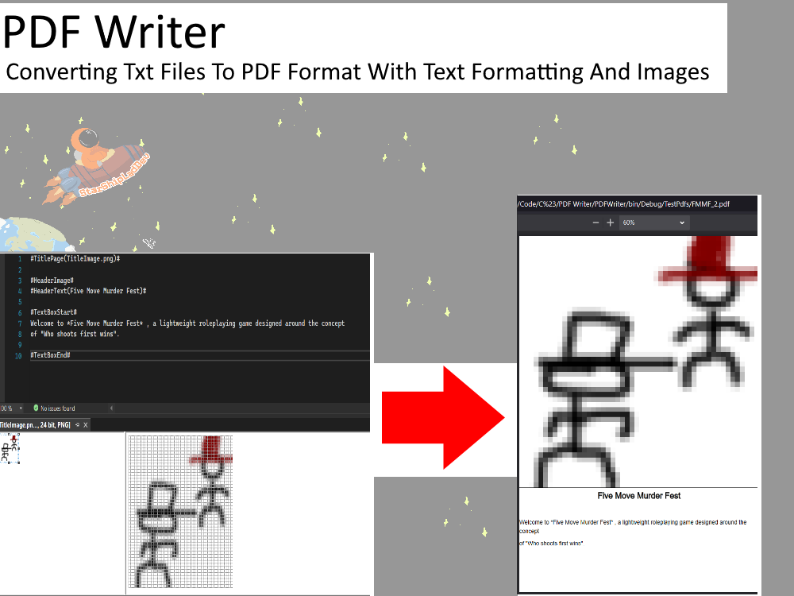
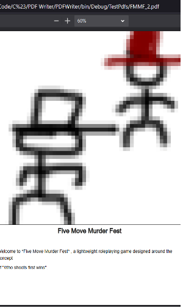

# PDFCreator - A Utility To Convert .TXT TO PDF With Text Formatting And Images



## Notes/Know Bugs:

> *Important* No in-textbox formatting

> Unit Tests Are Lackign At The Moment


## Features(Planned In Brackets)

Input Full-page or Scalable Images Via URI

Convert .txt Files Into .pdf Files

(In-text formatting (bold, italic ect. ect.))

## View of progress
**Build 1 - Basic Text / Headers and Title Images**




## Latest Build

*27/04/2022 Build 1 - *

*Image of the latest build. Basic Text / Headers and Title Images*

## Latest Update Notes:

```

"27/04/2022 Basic Text / Headers and Title Images":{
	"Title":"Basic Text / Headers and Title Images",
	"Summary":"Sperated Test Functions And User-Functions Into Speperate Class, Add New Unit Tests , Add New Commands",
	"PDFWriter":{
		"PDFWriterFunction":{
			"ParseRenderFile()":["Modify Command Handling For Title Images, Header-style Text To Implement Core Features"],
			"GetArgumentInBrackets()":["Add Utility Function To Read Parenethesis-contained arguments in .txt file to isolate long code"],
			"GetFileLineCommandType()":["Modify Function To Parse Commands Without Arguments As TextBox Commands Were Not Reading"],
			"InputImage()":["Add Function To Allow Image Content In PDF To Allow Core Features More Easily"]
		},
		
		"PDFCreatorTestFunctions":{
			"CreateTestPdf":["Move Function To New Static'PDFCreatorTestFunctions' class to format 'PDFWriterFunction' class"],
			"FilltestImage":["Move Function To New Static'PDFCreatorTestFunctions' class to format 'PDFWriterFunction' class"],
			"LoadImage":["Move Function To New Static'PDFCreatorTestFunctions' class to format 'PDFWriterFunction' class"]
			
		}
	},
	"PDFWriterTestProject":["Add Test To Confirm PDF Is Created And No Error Thrown WHen Adding Image When TXT 'Title' Command Added"],
	"TODO":["Add summary doucmentation to all functions, Create In-text formatting options, Add Non-title Page Image Handling"]
	
}

```

## Latest Updates


*27/04/2022 Build 1 - *

*Image of the latest build. Basic Text / Headers and Title Images*

## Next Build

~ 15/05/2022 - In Text Formatting  And Header Images  **Delay notes**

*  summary doucmentation to all functions

* Create In-text formatting options

* Add Non-title Page Image Handling


## Skill developing

I planned on this project improving my skills in the following:

> Test-Driven Development. All New Builds Will Be Designed With Unit Tests First

> PDF Layout

> Keeping My C# Skills Sharp (excuse the pun :P )

## Installing and Compiling:

Open the project in VIsual Studio, build it, run using the 'play' button.

Useful .txt file commands are:

*TitlePage(ImageFile.png)* - Swap 'ImageFile.png' with the URI to any iamge to make it a full page image

*HeaderImage(ImageFile.png)* - Swap 'ImageFile.png' with the URI to any iamge to make it a 1/4 page image

*TextBoxStart* - Until the 'TextBoxEnd' Command is read, all text between will be written to the document as plain text

*TextBoxEnd* - See Above

*HeaderText(Text)* - Swap 'Text' With Any Text To Display It In Bold 

Developed by Starshiplad 

[Twitter](https://twitter.com/StarshipladDevp) 

[Discord](https://discord.gg/jAqfVpmqdA)

